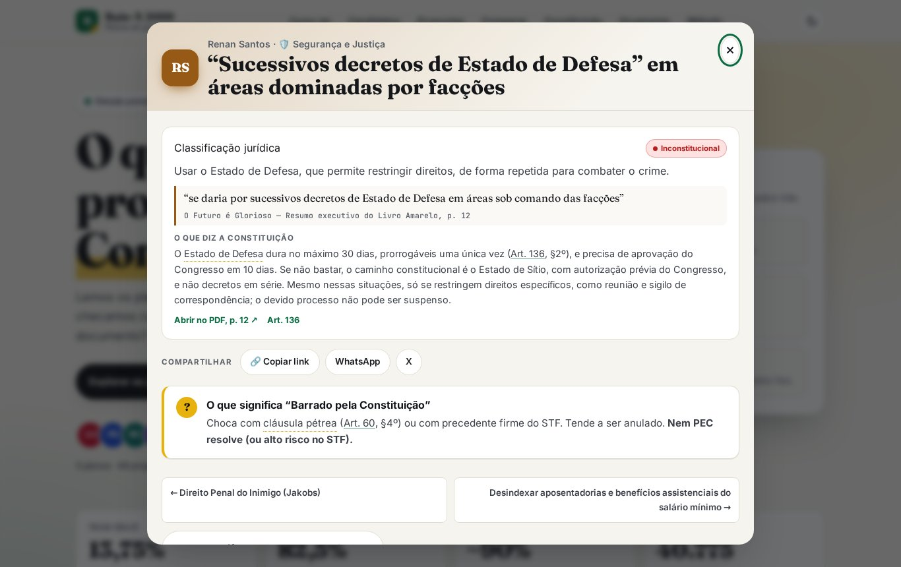
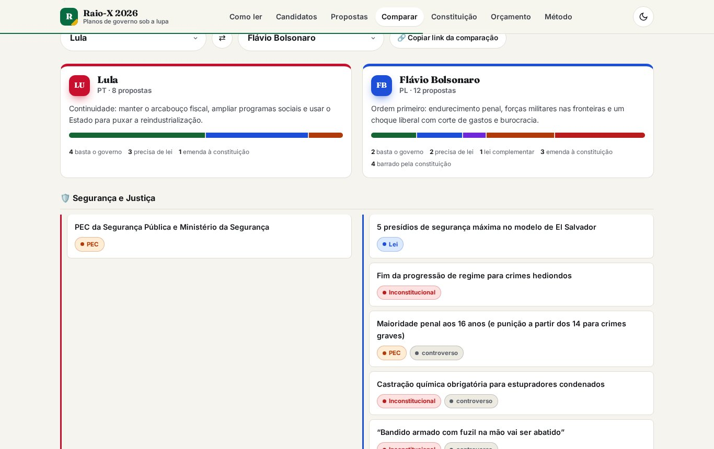

# Raio-X dos Planos de Governo 2026

[](https://github.com/matheusmendez-ask/eleicoes-2026/actions/workflows/ci.yml)
[](https://github.com/matheusmendez-ask/eleicoes-2026/actions/workflows/deploy.yml)

**O que os candidatos prometem, e o que a Constituição e o orçamento deixam fazer.**

🔗 **[matheusmendez-ask.github.io/eleicoes-2026](https://matheusmendez-ask.github.io/eleicoes-2026/)**

Site de jornalismo de dados que analisa, proposta por proposta, os planos de governo de cinco candidatos à Presidência em 2026: Lula, Flávio Bolsonaro, Ronaldo Caiado, Augusto Cury e Renan Santos.


## Como funciona

Cada uma das **48 propostas** passa por três filtros:

1. **Está no plano?** Página e citação literal do PDF oficial, com link que abre na página certa.
2. **O que precisa mudar na lei?** Classificação numa escada de 5 degraus: *só o governo → lei → lei complementar → emenda constitucional → inconstitucional*. Leis, decisões do STF e artigos da CF citados na análise levam à fonte oficial.
3. **Cabe no orçamento?** As cifras dos planos são comparadas ao espaço livre real do orçamento federal de 2026.

| Proposta com link próprio e prévia para redes sociais | Comparação lado a lado |
|---|---|
|  |  |

## Funcionalidades

- **Escada da Constituição**: explicador visual dos quóruns (maioria simples, absoluta, 3/5) e de quantas propostas caem em cada degrau.
- **Matriz filtrável** por tema, candidato e degrau jurídico, com busca que ignora acentos.
- **Frente a frente**: dois candidatos lado a lado, tema a tema, com link compartilhável (`#comparar/lula,flavio_bolsonaro`).
- **Link por proposta** (`#p/renan_santos/estado-de-defesa`), com botões de copiar, WhatsApp, X e compartilhamento nativo. Cada proposta tem uma página estática com **imagem Open Graph gerada automaticamente**, para aparecer com prévia nas redes.
- **Glossário contextual**: termos como *cláusula pétrea*, *PEC* e *GLO* ganham explicação flutuante onde aparecem no texto.
- **Radar da CF/88**: os artigos mais "testados" pelos planos, com o texto e as propostas afetadas.
- **Orçamento interativo** e, no dossiê de cada candidato, gráfico das cifras do plano comparadas ao espaço livre.
- **Registro de correções**: tudo o que estava errado na primeira versão e como foi corrigido.


## Qualidade

| Lighthouse (Chromium, servidor local) | Desempenho | Acessibilidade | Boas práticas | SEO |
|---|---|---|---|---|
| Desktop | 100 | 100 | 100 | 100 |
| Celular (4G simulado) | 95 | 100 | 100 | 100 |

- Tema claro e escuro, layout responsivo, navegação por teclado com foco preso nos modais e respeito a `prefers-reduced-motion`.
- Contraste AA verificado em todos os selos e cores de candidatos nos dois temas.
- Fontes servidas localmente (sem Google Fonts), sem rastreadores e sem dependências em tempo de execução.
- `npm test` valida a base de dados a cada push: campos obrigatórios, páginas dentro do PDF, artigos citados, URLs das fontes, soma do orçamento e páginas de compartilhamento desatualizadas.

<br clear="right">

## Estrutura

```
index.html              estrutura e textos fixos
css/styles.css          design system (tokens, tema escuro, componentes)
js/data.js              base de dados: candidatos, propostas, artigos, orçamento, fontes
js/app.js               renderização, rotas, filtros, modais e compartilhamento
fonts/                  Fraunces, Inter e JetBrains Mono (SIL OFL)
planos/                 PDFs originais dos planos de governo
share/                  páginas e imagens de prévia geradas (não editar à mão)
scripts/validate.cjs    validação da base (roda no CI)
scripts/build-share.cjs gera share/ a partir de js/data.js
.github/workflows/      CI e deploy no GitHub Pages
```

Toda a interface é gerada a partir de `js/data.js`.

## Rodando localmente

```bash
npm start          # http://localhost:8000
npm test           # valida os dados
```

### Adicionando ou editando uma proposta

1. Edite `candidates[].proposals` em `js/data.js` (`id`, `theme`, `title`, `plain`, `page`, `verdict`, `legal`, `arts`).
2. Gere as páginas de compartilhamento:
   ```bash
   npm install        # instala o Playwright (só para este passo)
   npm run build:share
   ```
3. Rode `npm test` e faça o commit.

### Publicação

O deploy é automático a cada push na `main`, desde que a validação passe. Na primeira vez, ative em **Settings → Pages → Source: GitHub Actions**.

## Método e limites

- A classificação indica o **instrumento mínimo** para implementar a proposta como está escrita. O selo "controverso" marca divergência relevante entre juristas ou no STF.
- O site não dá notas nem ranking, não avalia se uma proposta é boa ou ruim e não substitui um parecer jurídico.
- Há 13 candidaturas registradas no TSE; o recorte de cinco planos não é um juízo sobre quem são os "principais".
- Indicadores: BCB (Selic de 16/09/2026; dívida de jul/2026), IBGE (IPCA de ago/2026; PIB de 2025), LOA 2026 e Anuário do Fórum Brasileiro de Segurança Pública 2026.

---

Desenvolvido por **Matheus Mendez** · [Licença MIT](LICENSE)
